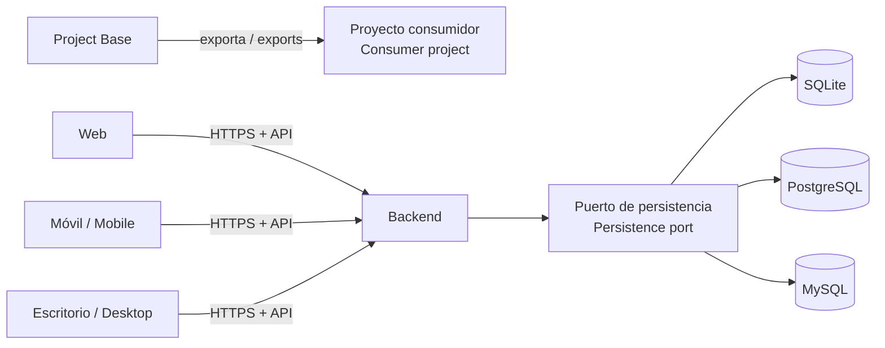

# Project Base

[](https://github.com/rody8708/project-base/actions/workflows/technical-bases.yml)
[](LICENSE)
[](releases/approval-1.1.0.en-US.md)

**ES:** Bases verificadas y reutilizables para comenzar aplicaciones web, móviles, Android, de escritorio y backend sin partir de una carpeta vacía.

**EN:** Verified, reusable foundations for starting web, mobile, Android, desktop, and backend applications without beginning from an empty folder.

> [Documentación completa en español latinoamericano](README.es-419.md) · [Full documentation in US English](README.en-US.md)

## ¿Qué es? / What Is It?

**ES:** Este repositorio proporciona estructuras de proyecto ejecutables, código inicial, pruebas, contratos API, persistencia, reglas de ingeniería y una herramienta de exportación. Sirve como punto de partida técnico para construir tu propia aplicación sobre decisiones conocidas y comprobables.

**EN:** This repository provides executable project structures, starter code, tests, API contracts, persistence, engineering rules, and an export tool. It is a technical starting point for building your own application on known, verifiable decisions.

**No es solamente documentación, pero tampoco es una aplicación terminada. / It is not documentation alone, but it is not a finished application either.**

Project Base prepara los cimientos; tú, tu equipo o un asistente de programación construyen las funciones particulares del producto. / Project Base prepares the foundations; you, your team, or a coding assistant build the product-specific features.

## ¿En qué me beneficia? / How Does It Help Me?

| Beneficio / Benefit | Qué significa / What It Means |
| --- | --- |
| No empezar desde cero / Avoid starting from zero | Recibes código inicial ejecutable, estructura y pruebas. / You receive executable starter code, structure, and tests. |
| Menos acoplamiento / Less coupling | Los clientes se comunican con el backend únicamente mediante una API. / Clients communicate with the backend only through an API. |
| Tecnología reemplazable / Replaceable technology | Puedes cambiar frontend, backend o base de datos conservando sus límites. / You can change the frontend, backend, or database while preserving their boundaries. |
| Decisiones comprobables / Verifiable decisions | Se distingue lo probado, lo pendiente y lo que depende de cada producto. / Verified, pending, and product-specific work are explicitly distinguished. |
| Menos trabajo repetido / Less repeated work | Exportación, validación, autenticación básica, permisos y persistencia ya tienen una base. / Export, validation, basic authentication, permissions, and persistence already have a foundation. |
| Libertad de implementación / Implementation freedom | Puedes usar un framework probado o construir una arquitectura propia. / You may use a proven framework or build your own architecture. |

## ¿Qué incluye? / What Is Included?

| Tipo / Type | Opción / Option | Uso / Use |
| --- | --- | --- |
| Web | React + TypeScript + Vite ([ES](starters/web/README.es-419.md) · [EN](starters/web/README.en-US.md)) | Aplicaciones web con herramientas modernas. / Web applications with modern tooling. |
| Web sin framework / Framework-free web | HTML + CSS + JavaScript ([ES](starters/web-vanilla/README.es-419.md) · [EN](starters/web-vanilla/README.en-US.md)) | Fundamentos web nativos, sin compilación. / Native web foundations without a build step. |
| Móvil y escritorio / Mobile and desktop | Flutter ([ES](starters/flutter/README.es-419.md) · [EN](starters/flutter/README.en-US.md)) | Código compartido para varias plataformas. / Shared code for multiple platforms. |
| Android nativo / Native Android | Kotlin + Jetpack Compose ([ES](starters/kotlin-android/README.es-419.md) · [EN](starters/kotlin-android/README.en-US.md)) | Android nativo y capacidades fuera del alcance de Flutter. / Native Android and capabilities beyond Flutter's scope. |
| Backend con framework / Framework backend | PHP + Laravel ([ES](starters/backend-php/README.es-419.md) · [EN](starters/backend-php/README.en-US.md)) | API probada con SQLite, PostgreSQL y MySQL. / Tested API with SQLite, PostgreSQL, and MySQL. |
| Backend propio / Custom backend | TypeScript + Node ([ES](starters/backend-node/README.es-419.md) · [EN](starters/backend-node/README.en-US.md)) | API sin framework de aplicación, organizada mediante puertos y adaptadores. / Application-framework-free API organized through ports and adapters. |
| Backend Python | Python + FastAPI ([ES](starters/backend-python/README.es-419.md) · [EN](starters/backend-python/README.en-US.md)) | API tipada con puertos, adaptadores SQL y migraciones versionadas. / Typed API with ports, SQL adapters, and versioned migrations. |

También incluye documentación bilingüe, reglas de programación, plantilla de definición de producto, integración HTTP, tokens provisionados, autorización por propietario, pruebas automatizadas y CI protegida. / It also includes bilingual documentation, programming rules, a product brief template, HTTP integration, provisioned tokens, owner authorization, automated tests, and protected CI.

## Arquitectura propuesta / Proposed Architecture



Los clientes nunca acceden directamente a la base de datos. El backend protege las reglas, la autorización y la persistencia. Los adaptadores permiten reemplazar componentes sin cambiar el contrato API público. / Clients never access the database directly. The backend protects rules, authorization, and persistence. Adapters allow components to be replaced without changing the public API contract.

## ¿Me crea la aplicación completa? / Does It Create My Complete Application?

| Project Base sí hace / Project Base does | Project Base no hace / Project Base does not |
| --- | --- |
| Prepara proyectos técnicos independientes. / Prepares independent technical projects. | Decide tu idea, negocio o audiencia. / Decide your idea, business, or audience. |
| Proporciona ejemplos ejecutables y pruebas. / Provides executable examples and tests. | Crea automáticamente todas tus pantallas y funciones. / Automatically create all screens and features. |
| Define límites para API, seguridad y datos. / Defines API, security, and data boundaries. | Convierte un ejemplo en producción sin validación. / Turn an example into production without validation. |
| Permite combinar o reemplazar componentes. / Allows components to be combined or replaced. | Te obliga a usar Laravel, Flutter u otro framework. / Force you to use Laravel, Flutter, or another framework. |

Por ejemplo, para una aplicación de citas la base puede preparar el cliente, backend, API, almacenamiento, permisos y pruebas. El producto todavía debe implementar pacientes, calendarios, reservaciones, notificaciones, pagos y diseño visual. / For an appointment application, the foundation can prepare the client, backend, API, storage, permissions, and tests. The product must still implement patients, calendars, bookings, notifications, payments, and visual design.

## ¿Cómo se usa? / How Do I Use It?

1. **Definir / Define:** explicar el problema, los usuarios, las funciones esenciales, plataformas y datos.
2. **Elegir / Select:** escoger uno o más clientes, un backend y los motores de datos realmente necesarios.
3. **Exportar / Export:** crear cada componente en una ubicación nueva y separada de este repositorio.
4. **Personalizar / Customize:** cambiar identidad, dominios, identificadores y configuración del producto.
5. **Construir / Build:** agregar funciones por cortes pequeños que incluyan contrato, backend, cliente y pruebas.
6. **Validar / Validate:** comprobar seguridad, migraciones, carga, respaldo, restauración y despliegue real.

Ejemplo de exportación en Windows / Windows export example:

```powershell
node tools/create-project.mjs --template backend-php --name ejemplo-api --destination "D:\products\ejemplo-api"
node tools/create-project.mjs --template web --name ejemplo-web --destination "D:\products\ejemplo-web"
```

Cada comando crea un proyecto independiente. El exportador no sobrescribe destinos, no instala dependencias, no configura cuentas y no publica la aplicación. / Each command creates an independent project. The exporter does not overwrite destinations, install dependencies, configure accounts, or publish the application.

> [Procedimiento completo en español](docs/getting-started.es-419.md) · [Complete procedure in English](docs/getting-started.en-US.md)

## Agentes y MCP / Agents and MCP

Un asistente con terminal puede seguir [`AGENTS.md`](AGENTS.md). Un host compatible con MCP también puede iniciar el servidor local `tools/mcp-server.mjs` para leer las reglas, consultar las plantillas, diagnosticar requisitos y crear una solución nueva mediante herramientas estructuradas. / An assistant with terminal access can follow [`AGENTS.md`](AGENTS.md). An MCP-compatible host can also start the local `tools/mcp-server.mjs` server to read rules, list templates, diagnose requirements, and create a new solution through structured tools.

> [Guía MCP en español](docs/agent-guide.es-419.md) · [MCP guide in English](docs/agent-guide.en-US.md)

## Si no sé programar / If I Do Not Know How to Program

Puedes usar esta base con un desarrollador o un asistente de programación. Empieza describiendo tu idea sin términos técnicos:

> Quiero crear una aplicación para `[objetivo]`, dirigida a `[usuarios]`, disponible en `[plataformas]` y con estas tres funciones: `[funciones]`. Ayúdame a definirla y utiliza Project Base para preparar los componentes necesarios sin acoplar los clientes al backend.

You can use this foundation with a developer or coding assistant. Start by describing your idea without technical terminology:

> I want to create an application for `[goal]`, aimed at `[users]`, available on `[platforms]`, with these three features: `[features]`. Help me define it and use Project Base to prepare the required components without coupling clients to the backend.

La base reduce decisiones improvisadas, pero no sustituye el desarrollo, el aprendizaje ni la revisión humana. / The foundation reduces improvised decisions, but it does not replace development, learning, or human review.

## Estado actual / Current Status

- Publicación técnica estable / Stable technical release: [`v1.2.0`](releases/approval-1.2.0.en-US.md).
- Licencia de código abierto / Open-source license: [MPL-2.0](LICENSE).
- Política operativa / Operational policy: [estándares en español](docs/engineering-standards.es-419.md) · [standards in English](docs/engineering-standards.en-US.md).
- CI automática para pull requests / Automatic pull-request CI: web, mantenimiento, Flutter core, Kotlin Android, PHP/SQLite, Node y Python con SQLite/PostgreSQL/MySQL.
- Probado localmente / Locally tested: integración API; PHP, Node y Python con SQLite, PostgreSQL y MySQL aislados. / API integration; PHP, Node, and Python with isolated SQLite, PostgreSQL, and MySQL.
- Pendiente / Pending: compilación y ejecución verificadas en macOS/iOS hasta disponer de una Mac adecuada.
- No incluido / Not included: cuentas humanas completas, credenciales reales, firma de distribución y un producto desplegado.

La aprobación de Project Base no aprueba automáticamente una aplicación creada con ella. Cada producto debe registrar y verificar su propia adopción. / Approval of Project Base does not automatically approve an application created from it. Every product must record and verify its own adoption.

## Licencia y participación / License and Participation

El código y la documentación original se publican bajo la [Mozilla Public License 2.0](LICENSE). Las aplicaciones creadas utilizando esta base pueden comercializarse respetando sus obligaciones. Consulta el [alcance en español](LICENSE-SCOPE.es-419.md) o el [scope in English](LICENSE-SCOPE.en-US.md).

Project Base es mantenido por **Zendrhax LLC** bajo la marca **Zendrhax**. Consulta [cómo contribuir en español](.github/CONTRIBUTING.es-419.md) o [how to contribute in English](.github/CONTRIBUTING.en-US.md). Los reportes de seguridad siguen la [política en español](.github/SECURITY.es-419.md) o la [policy in English](.github/SECURITY.en-US.md).
